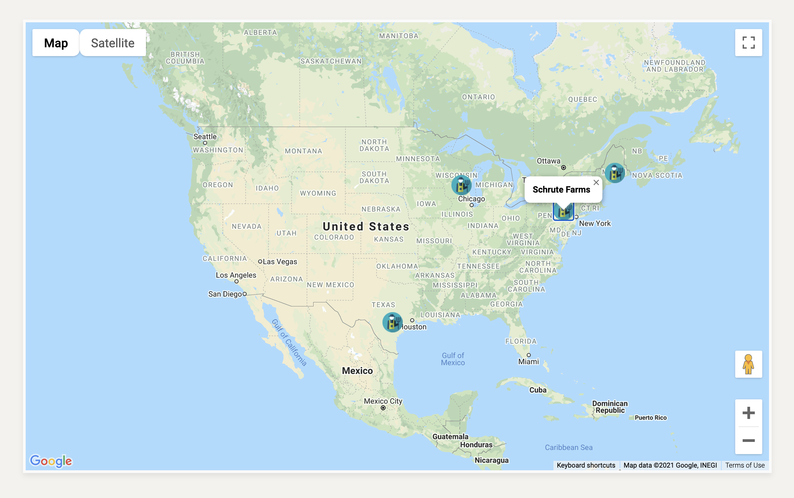
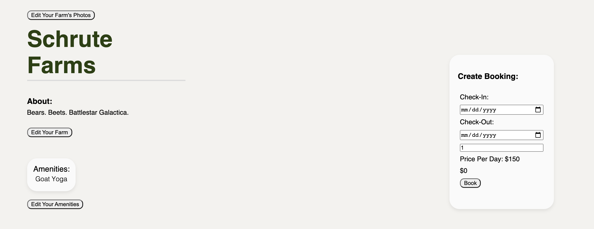
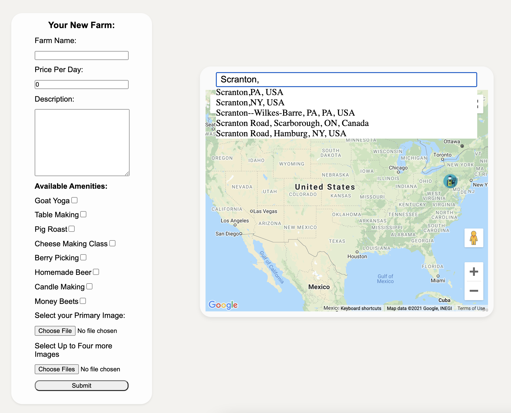
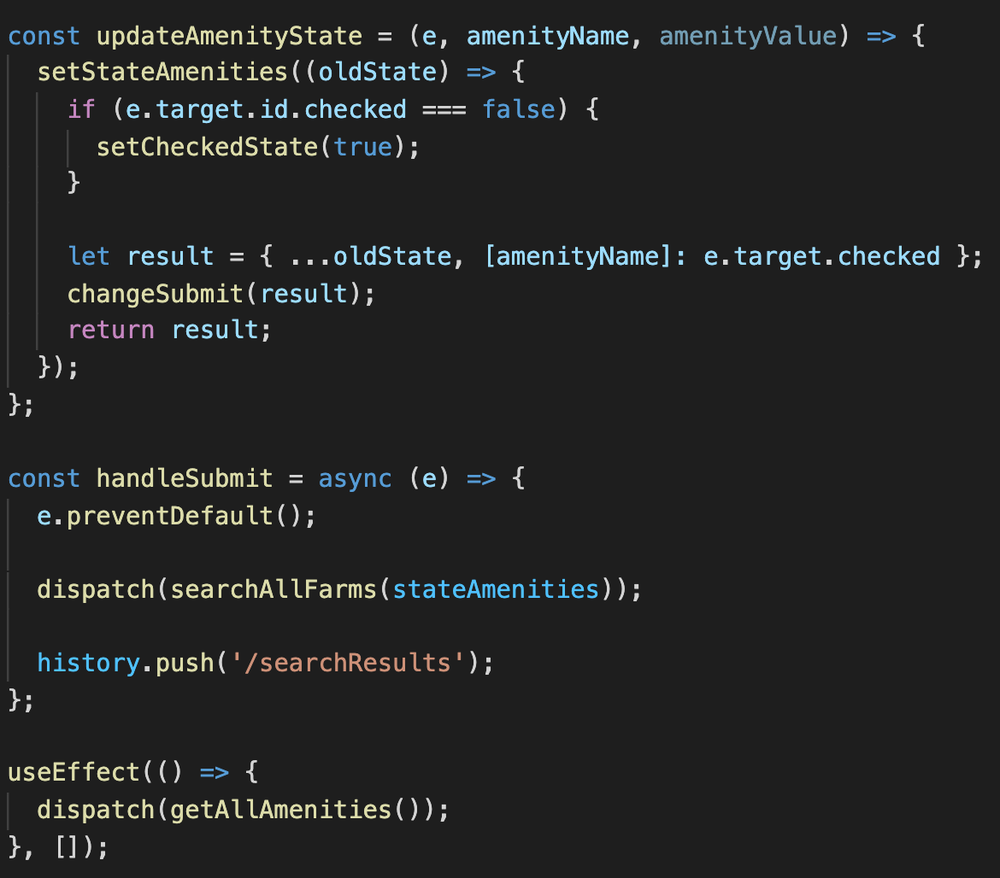
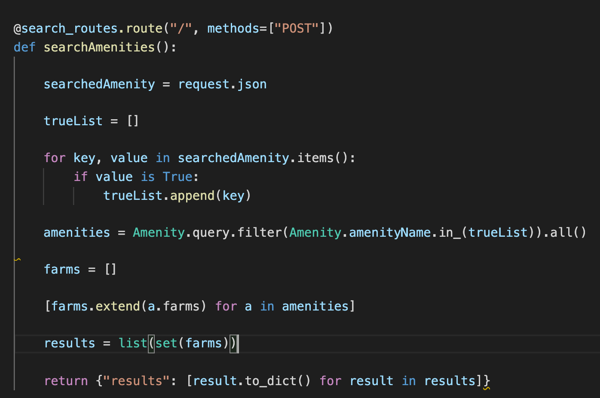
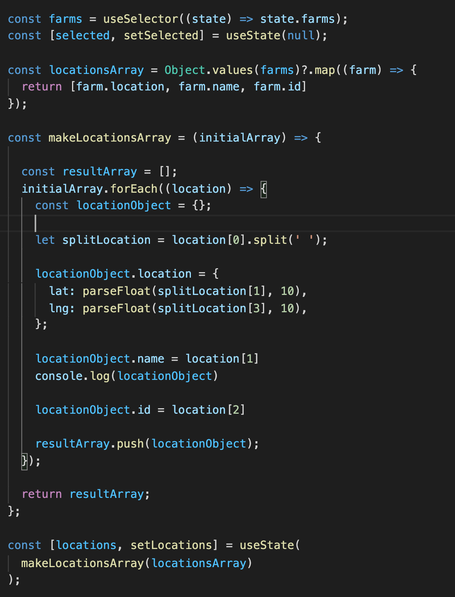

# FindAFarm

By [John Sims](https://github.com/simzeee)

FindAFarm is a one-stop-shop for the agro-tourism enthusiast. Allows individuals to find and book stays at farms near and far for that true farm-to-table experience.

## Index

- [API Documentation](https://github.com/simzeee/FindAFarm/wiki/API-Documentation)
- [Database Schema](https://github.com/simzeee/FindAFarm/wiki/Database-Schema)
- [Frontend Routes](https://github.com/simzeee/FindAFarm/wiki/Frontend-Routes)
- [MVP Feature List](https://github.com/simzeee/FindAFarm/wiki/MVP-List)

## Technologies Used

- JavaScript
- React/Redux
- CSS
- Python
- Flask/SQLAlchemy

## Overview

FindAFarm is a Air BnB/Hip Camp clone designed to allow guests to view details, photos, and descriptions of farms from around the country in order to book trips at individual owned farms. There are two times of users: the guest, and the farmer. Farmers have the ability to created, edit, and delete their farms while guests can create, edit, and delete bookings. Guests can become hosts/farmers in order to make extra money sharing their unique farm experience.

Users are greeted with a splash page in which they can search via different ammenities for the farm experience they desire.
They can use the NavBar in order to see their past bookings or view a list of all farms currently available. 

Users can also interact with a searchable map and click on whatever farm they would like to visit.

Then, once a farm is selected, the guest can view between one and 5 photos as well as details concerning what the farm offers in order to get an idea for what staying at this farm would be like. Farmers can see their current posted farm and edit each feature individually.

 When creating a farm, the farmer must choose their location and input the various characteristics as as well as photos and amenities that they will offer. 

## The "Find" in Find A Farm

To search for a farm via amenities, the React component keeps track of the "checked" state for each dynamically updated amenity. This involves carefully keeping track of each amenity's state and setting its checked state to true or false based on the user's selection. Having at least one selection allows the submit function to be enabled that upon clicking, sends an object with the key being the name of the amenity and the value being "true" or "false".

Then, in the backend a "trueList" is made of all amenities where checked equals true. Then, a new list of farms is constructed from the set of farms based on whether or not that farm contains the amenity. Finally, the result is returned as a dictionary and displayed in the search results.

## Farms Around the World

The second way to search a farm involves viewing a map of the world and choosing a location that is most desired by the user. When a new farm is created, the user sets the location via clicking on an interactive map and setting the latitude and longitude. The locations map React component sets the initial locations on the map by iterating through the farm Redux state's locations and extracting the lat/long in a way that the Google Maps Api can understand. Then, markers are set using the array of objects created earlier that also include each farm's id so that when the farm icon is clicked on, the info window can easily redirect you to that farm's page. 

