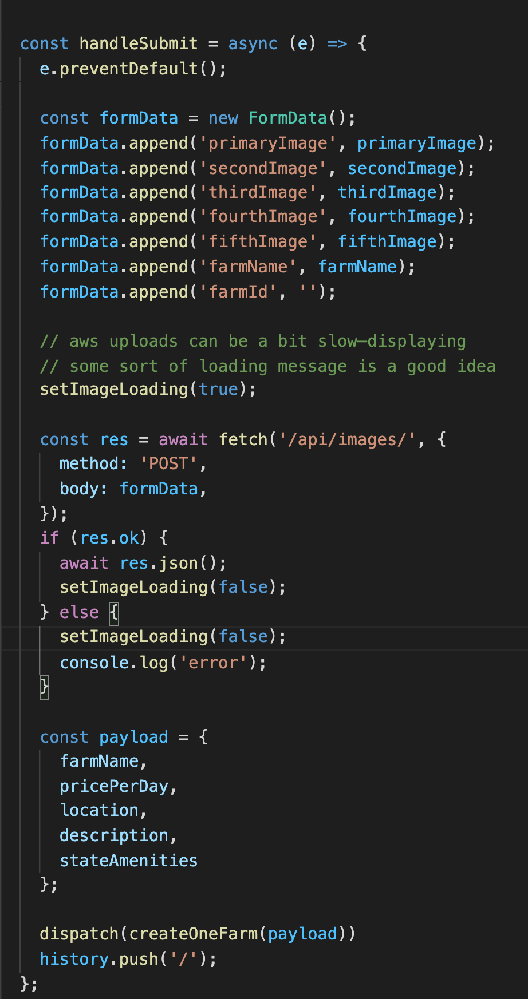
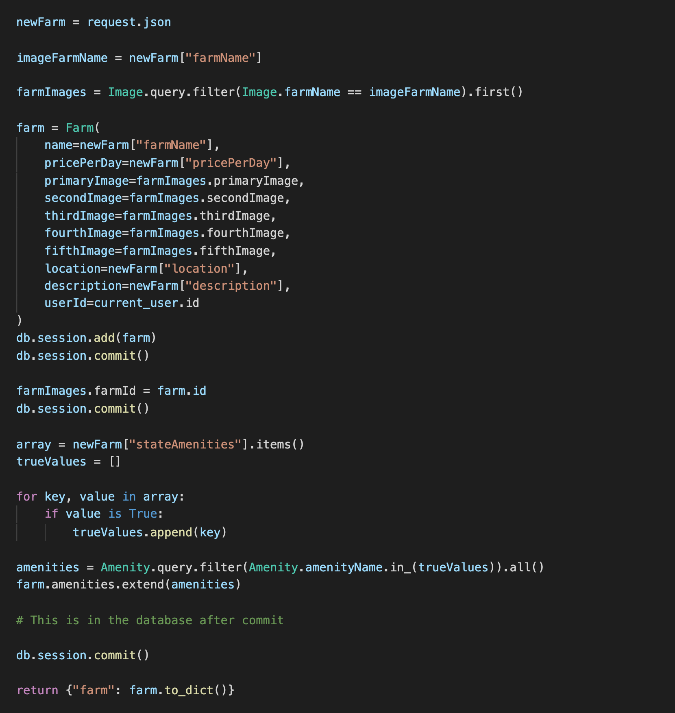

# FindAFarm

By [John Sims](https://github.com/simzeee)

[FindAFarm](https://findafarm.herokuapp.com/createFarm) is a one-stop shop for the agro-tourism enthusiast. This website allows individuals seeking a true farm-to-table experience to find and book stays at farms around the world.

## Index

- [API Documentation](https://github.com/simzeee/FindAFarm/wiki/API-Documentation)
- [Database Schema](https://github.com/simzeee/FindAFarm/wiki/Database-Schema)
- [Frontend Routes](https://github.com/simzeee/FindAFarm/wiki/Frontend-Routes)
- [MVP Feature List](https://github.com/simzeee/FindAFarm/wiki/MVP-List)

## Technologies Used

- JavaScript
- React/Redux
- CSS
- Python
- Flask/SQLAlchemy

## Overview

FindAFarm is an Air BnB/Hip Camp clone designed to allow guests to view details, photos, and descriptions of farms from around the country in order to book trips at family/individual owned farms. There are two types of users: the guest, and the farmer (host). Farmers have the ability to created, edit, and delete their farms while guests can create, edit, and delete bookings. Guests can become hosts/farmers in order to branch out and share their unique farm experience.

Users are greeted with a splash page in which they can search via different ammenities for the farm experience they desire. 

Users can also interact with a searchable map and click on whatever farm they would like to visit.

Then, once a farm is selected, the guest can view photos as well as details about what the farm offers in order to get an idea for what staying at here would be like. Farmers can see their current posted farm and edit each component individually.

When creating a farm, the farmer must choose their location and input the various characteristics as as well as photos and amenities that they will offer. There is a searchable Google Maps interface that allows farmer's to easily locate their farm and click the map to set their location.

## The "Find" in Find A Farm

To search for a farm via amenities, the React component keeps track of the "checked" state for each dynamically updated amenity. This involves carefully keeping track of each amenity's state and setting its checked state to true or false based on the user's selection. Having at least one selection allows the submit button to be enabled. Upon submitting, an object is sent with the key being the name of the amenity, and the value being the "checked" value of "true" or "false".

Then, in the backend a "trueList" is made of all amenities where checked "===" true. A new list of farms is then constructed from the set of farms based on whether or not that farm contains the amenity. Finally, the result is returned as a dictionary and displayed in the search results.

## Farms Around the World

The second way to search a farm involves viewing a map of the world and choosing a location that is most desired by the user. When a new farm is created, the user sets the location via clicking on an interactive map and setting the latitude and longitude. The "locations" React map component sets the initial locations on the map by iterating through the farms locations state, and extracting the lat/long in a way that the Google Maps Api can understand. Then, markers are set using the array of objects created earlier, which also include each farm's id so that when the farm icon is clicked, the info window can easily redirect you to that farm's page. 

# Farmers Create. It's what they do.

When a farm is created, a sophisticated dance begins. The timing was very important because image routes, amenity routes, and farm description routes are all separate for maximum customization. If one thing happens out of order, the entire process fails. We start by appending formData with the images uploaded and then posting the images in the backend. 

Then, we send the payload of the new farm information to the "create farm" backend route where the farm is located by name in order to associate it with it's previously created "image" row in the database. Finally, we create a list of all checked amenities and associate the farm with the amenities they have selected. The new farm is then returned to the frontend, and seamlessly updates with the new photos, description, and Google Maps location/icon.

## More to Come

I am constantly in the process of adding new features and optimizing the current ones. Here is a taste of things to come!

- Guests can leave reviews on the quality of their stays
- Guests and farmers can exchange messages
- Farmer's have a unique booking experience, where they can view who is staying at their farm
- Farmers can review guests (Dun dun duuuun!)
- Users can toggle between Farmer/Guest experience

Please, feel free to reach out to me on [LinkedIn](https://www.linkedin.com/in/jwsims/).
